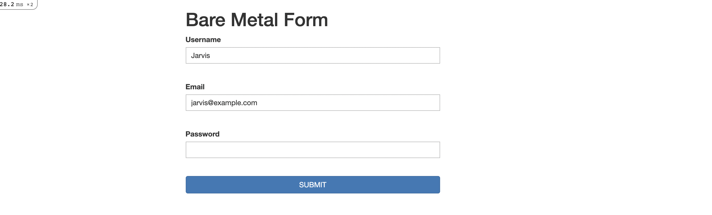

## Project Name: Bare Metal Forms and Helpers

### Objective:
Building forms, from nearly-pure HTML to using the helper methods that Rails provides. The Rails way sends parameters to a controller which builds an instance of a model with those parameters for the view.

## Features

> The front end ( `http://localhost:3000/users/new` ) displays a form which allows a user to input their username, email and password.
> The back end shows the server output and/or any errors stack trace.
> None of the input fields can be blank on the edit page: `http://localhost:3000/users/1`.
> On the edit page, if a user tries submitting a form that fails the validations, a list of error messages attached to the failed model is displayed.

## Prerequisites
- Ruby
- Rails
- SQLite3
- Node.js
- Yarn

## Getting Started
- Open your terminal - Windows: `Win + R`, then type `cmd` | Mac: `Command + space`, then type `Terminal`
- Navigate to a directory of your choosing using the `cd` command
- Run this command in your OS terminal: `git clone git@github.com:george-swift/re-former.git` to get a copy of the project.
- Navigate to the project's directory using the `cd` command
- Execute `rails s` to fire up the server
- Visit `http://localhost:3000/users/new` to see the form on your browser
- The edit page handles editing an existing user. The page is found by visiting `http://localhost:3000/users/1`
- To terminate the server, enter `Ctrl + C` in your terminal

## Authors

👤  &nbsp; **Miguel Ricardo Gomez**
- GitHub: [@MiguelArgentina](https://github.com/MiguelArgentina)
- Twitter: [@Qete_arg](https://twitter.com/Qete_arg)
- LinkedIn: [Miguel Ricardo Gomez](https://www.linkedin.com/in/miguelricardogomez/)

👤 &nbsp; **Ubong George**
- GitHub: [@george-swift](https://github.com/george-swift)
- Twitter: [@\_\_pragmaticdev](https://twitter.com/__pragmaticdev)

## Acknowledgments

Ruby on Rails Guide for technical information on how to be productive with Rails

## Show your support

Give a :star:️ &nbsp; if you like this project!

## License

Available as open source under the terms of the [MIT License](https://opensource.org/licenses/MIT).
